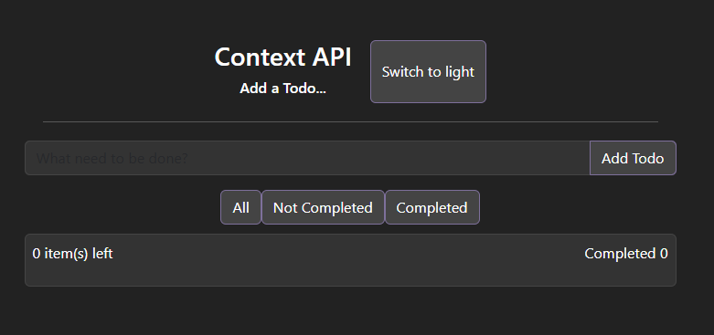

# React Context API Todo App

This is a simple Todo application built with **React**, **TypeScript**, and **Vite**.  
It demonstrates the use of the React Context API for state management, including theme switching (light/dark mode) and todo actions.

## Features

- **Add, toggle, and delete todos**
- **Filter** todos by All, Not Completed, or Completed
- **Clear completed** todos with one click
- **Theme switcher** (light/dark mode) affecting the whole page
- **Live summary** of total and completed todos, always visible at the bottom

## Tech

- React
- TypeScript
- Context API
- Functional Components & Hooks

## Getting Started

1. Clone the repository
2. Run `npm install`
3. Run `npm run dev`
4. Open [http://localhost:5173](http://localhost:5173) in your browser

## Screenshots

---

---
